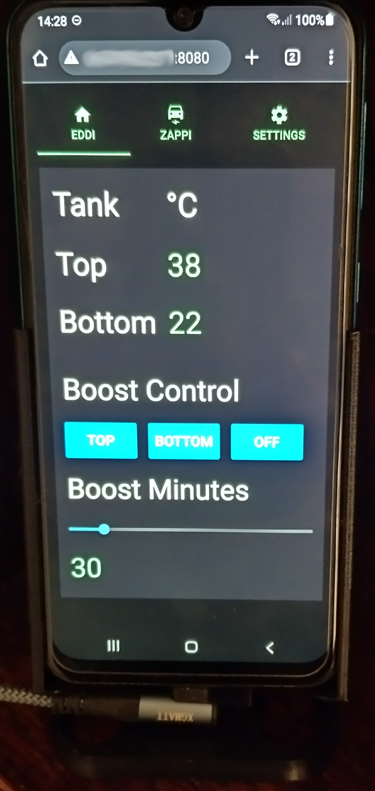
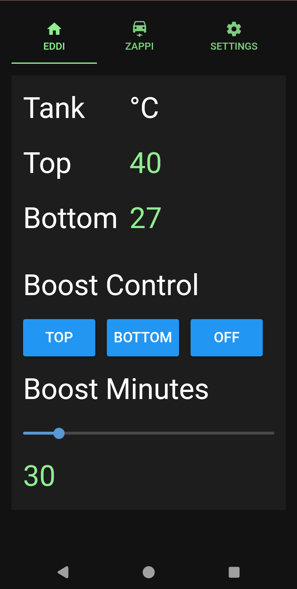
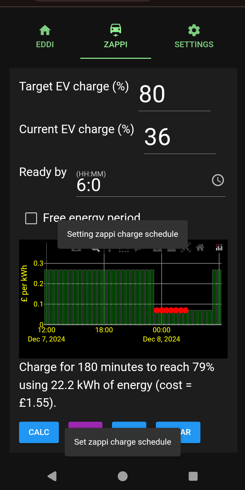

# myenergi display

# Overview
I have a [myenergi eddi](https://www.myenergi.com/eddi-power-diverter/) installed in my house. A while ago it replaced an [IBoost](https://www.marlec.co.uk/product/solar-iboost/) solar diverter
. When I had the IBoost unit I also had an [IBoost buddy](https://www.marlec.co.uk/product/solar-iboost-buddy/?v=79cba1185463) which allowed me to boost the hot water temperature when needed using the emersion heater. The iboost buddy sat on a shelf next to the solar generation display providing a convenient way to boost the hot water temperature.

The myenergi eddi unit has a very capable app that sits on your phone for controlling myenergi products but it's
complexity does not make it a direct replacement for the IBoost buddy.

I started thinking about creating a unit that provided some of
the capabilities of the IBoost buddy. As by this time I also had a Zappi EV car charger fitted, I also started
thinking how such a display unit could be used to ease the process of charging our EV.

After some thought I came to the view that it was not the best idea to create yet another piece of hardware that
served this purpose as I had many old mobile phones that essentially provide a display that could serve as a
display for myenergi products. This has the benefit of reusing hardware that may be otherwise thrown away.

I didn't want to develop an app for a phone due to the effort and maintenance issues that I've had with
other apps I've developed. Therefore I chose to develop a program in python that serves an app to a mobile
phone browser which looks similar to an app running on the phone.

I chose to host the python app on a Raspberry Pi zero 2 W as this has a power consumption of only about 0.7 watts. However it should be possible to host the server app on any platform that supports python3.12.

The result is shown below. The main features of this are

- Show the hot water tank temperatures.
- Allow the immersion heaters (top and bottom) to be set to boost mode.
- Allow an EV to be charged from the cheapest electricity via a simple interface.

The following is an image of a mobile phone showing the display.

A couple of examples of the app in use.

 

# Installation
Details of how to install and run this software on a Raspberry PI Zero 2 W can be found [here](doc/rpi_zero_installation.md). As the software is written in python it should be possible to run it on any platform that supports python version 3.12 (E.G Ubuntu or Windows).

# Starting the server
Once the installation is complete you need to start the start the myenergy display server. Click [here](doc/starting_the_server.md) for details on how to start the myenergy display server.

# Configuration
Once you have started the myenergi display server it must be configured. Click [here](doc/configuring_the_server.md) for details on how to configure the myenergy display server.

# Hot water tank display
Details on how to use the display to view the hot water tank temperatures and control the hot water boost can be found [here](doc/hot_water_tank.md).

# Electric Vehicle charging display
Details on how to use the display to charge an EV can be found [here](doc/ev_charging.md).

# 3D printed stand
I created a stand to hold a mobile phone and details of this can be found [here](mobile_phone_stand/README.md)
