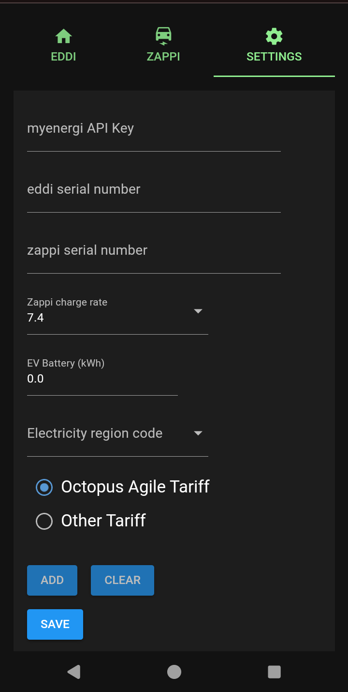
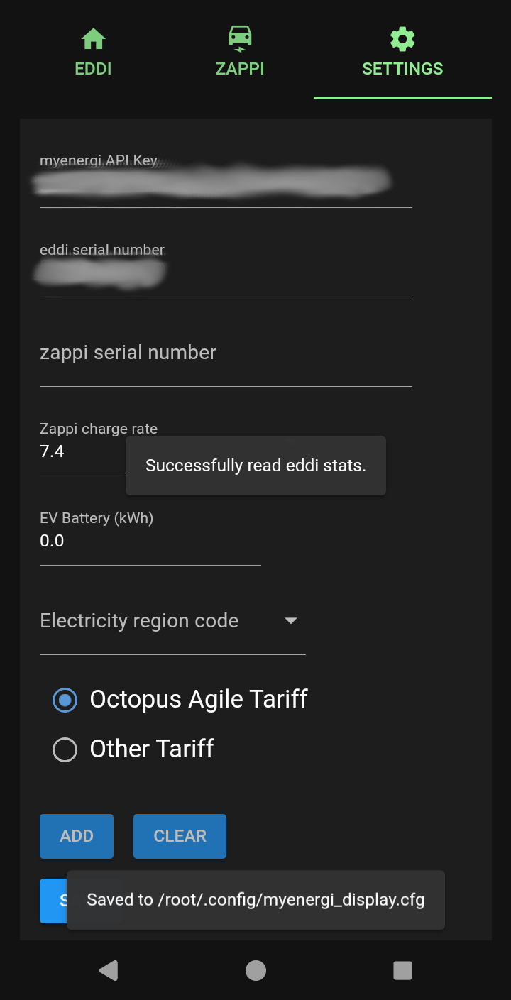
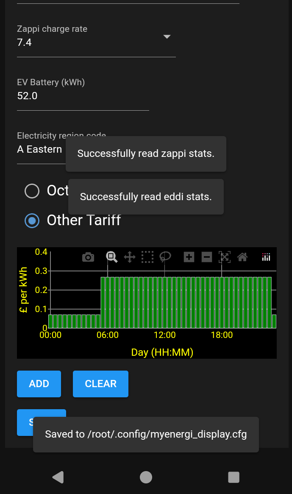
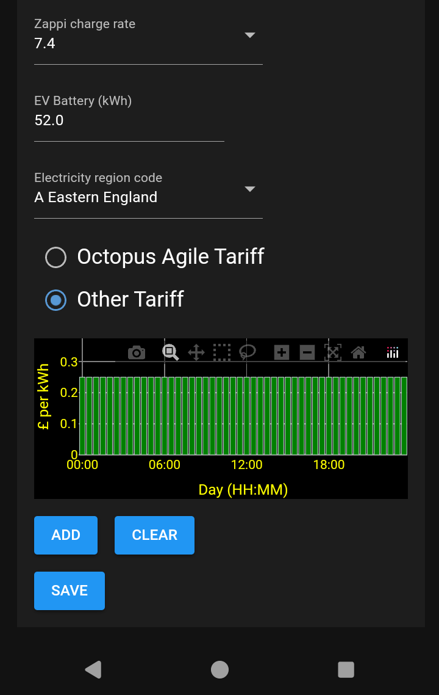
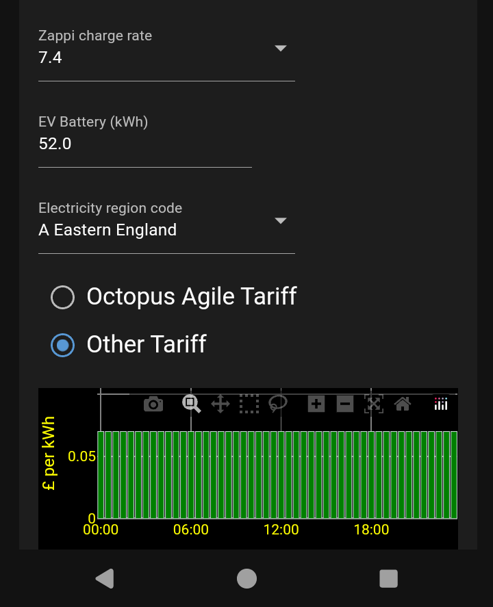
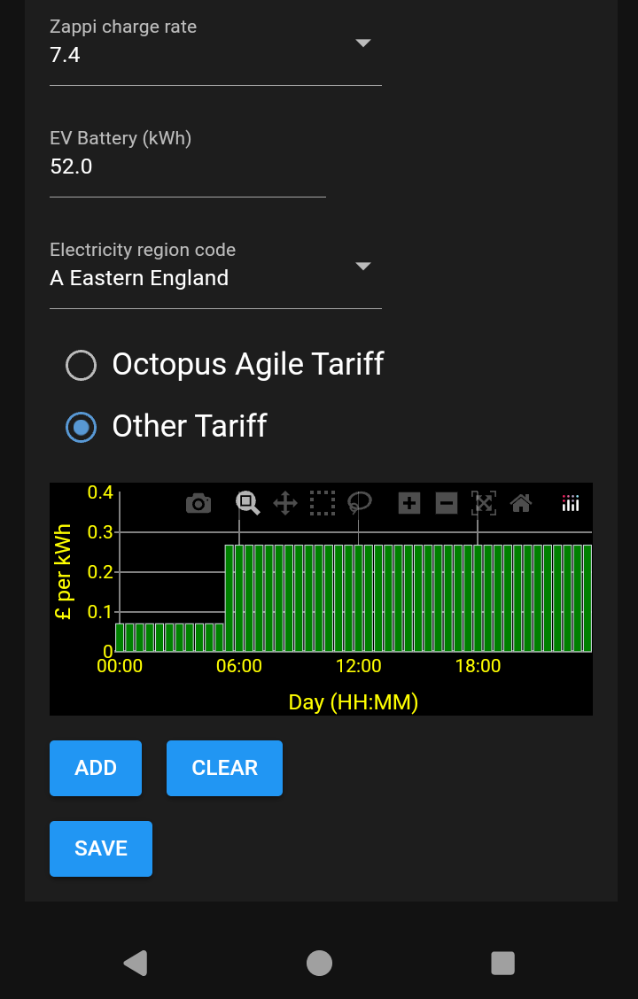
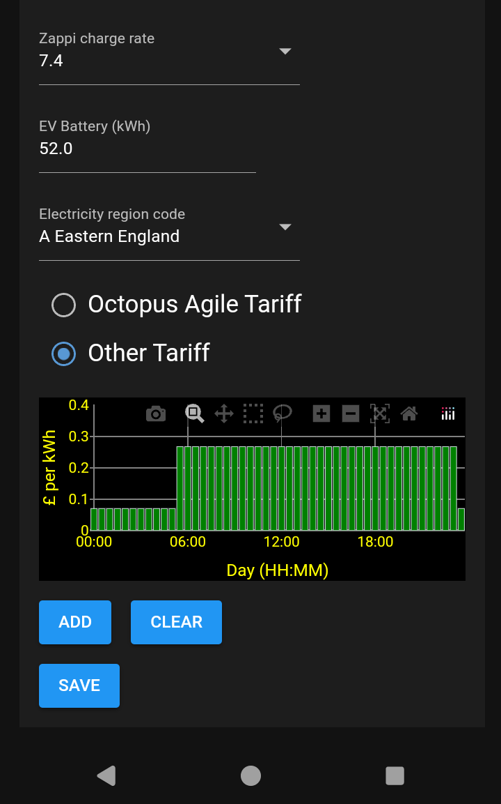

## Configuration
Once the myenergi display server app has been started it must be configured. In order to configure the unit you must have a myenergi API key. Details of how to obtain this API key can be found [here](https://support.myenergi.com/hc/en-gb/articles/5069627351185-How-do-I-get-an-API-key). The myenergi API key is a sequence of 24 letters and numbers.

Along with the myenergi API key you must also have the serial number of your myenergi eddi unit and myenergi zappi unti (if you have one). See [here](https://support.myenergi.com/hc/en-gb/articles/4420098391953-How-do-I-find-my-serial-number-and-registration-code) for more information on finding your myenergi device serial numbers. Each myenergi device serial number is an 8 digit number.

Once you have the above information select the Settings tab on the device (mobile phone) you have connected to the myenergi server. You should then see the following.

Enter your myenergi API key and eddi serial numbers and then select the Save button. You should see the following

If you see any error messages check the myenergi API key and eddi serial number are correct.

## Zappi Configuration
Extra configuration is required if you have a zappi EV charger.

Enter

- Your zappi serial number.
- Select the charge rate of your zappi charger (7.4 or 22 kW).
- Enter the size (in kWh) of the battery in your electric vehicle (EV).
- Select your UK region code from the dropdown list.
- Select either the Agile tariff or Other Tariff radio buttons. See the 'Adding Other Tariff details' for more information on adding your tariff details if not on the Octopus Agile tariff.

When you have entered the above, select the Save button and you should see the following (only the lower half of the screen is shown so the API key and serial numbers are not shown).

If you see any error messages check the myenergi API key, eddi and zappi serial numbers are correct.

### Adding Other Tariff details
If you have a zappi EV charger and are not on the Octopus Agile tariff then you should have selected the Other Tariff radio button. In this case you must enter your tariff details for a 24 hour period.

- Fixed price tariff
If you are on a fixed price tariff (same cost per kWh throughout the day and night) select the add button and enter the time as 0:0 and your electricity price in £ per kWh. In the example below the price entered was 0.25. Select the OK button and your tariff should be plotted as shown below.

- Variable tariff
If you are on a tariff that changes through the day/night you should enter the tariff at 0:0 (12 AM) first as shown below. In this case the tariff value was £0.07 per kWh.

You should then enter the next time the tariff changes through the day. In this case the tariff changed to value was £0.2672 per kWh at 5:30 in the morning.

Repeat this process until the graph shows all the changes in your tariff value throughout the day. In this case the tariff changed back to £0.07 per kWh at 23:30.

The example above shows the values for the Intelligent Octopus Go tariff.

### Note

- If you are on the Octopus Energy, Intelligent Octopus Go tariff then you should ensure that you have the Smart control off if you plan to use the myenergi display to charge your EV. This option can be found on the Devices tab of the Octopus mobile phone app.