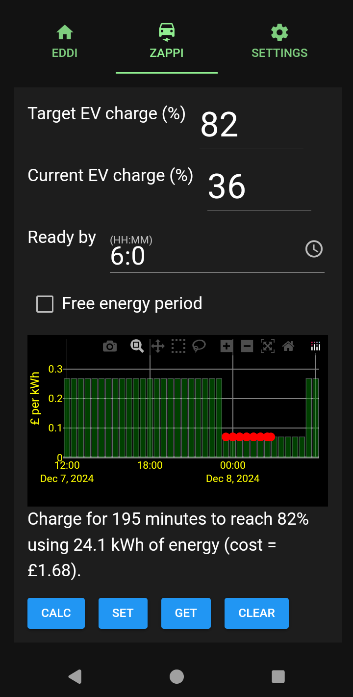
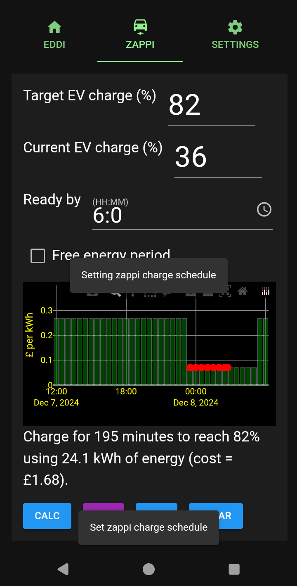
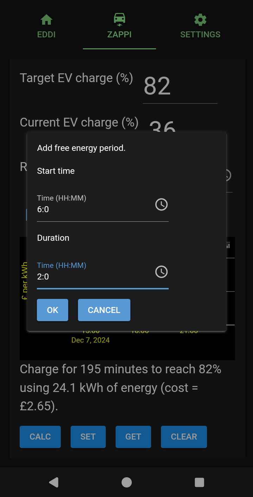
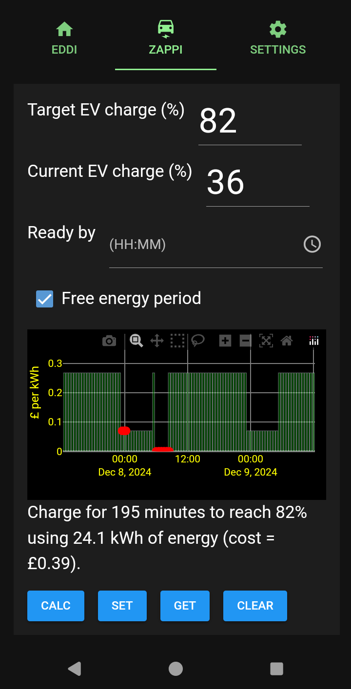
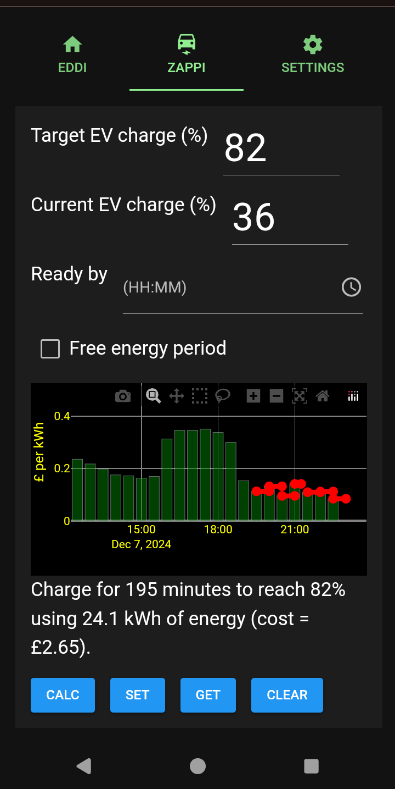

# Charging your EV
The app can be used to charge your EV. The app will select the times when your electricity is cheapest.

You must select the ZAPPI tab to display the screen shown below.

The three fields at the top of the page are

- Target EV Charge (%)

    You may enter how full you want the EV battery to be when the charge is complete. This can be set up to 100%.

- Current EV charge (%)

    You must enter the current state of charge of your EV battery in order that sufficient energy to reach the target EV charge can be delivered.

- Ready by

    You may enter the time that you wish the EV to be charged in HH:MM format. When calculating the charge, this time will be taken into account.

- Free energy period

    If your electricity provider notifies you of a period of time when free electricity will be available to you you can select this checkbox. If selected
    when you press the CALC button you will be prompted to enter the start time and duration of the free electricity period. This period is included in the
    calculation when determining the optimal charge period to reach your target charge level on your EV.

The buttons have the following functions.

- CALC

    Calculate the optimal charge schedule to give the lowest cost charge and plot the results.

- SET

    Set the displayed charge schedule. This sends the charge schedule to the myenergi system so that your zappi charges your EV.

- GET

    Get the schedule that the myenergi system holds for your zappi charger. It may take some time for this to update after setting the charge schedule.

- CLEAR

    Clear the charge schedule for your zappi charger. After selecting this it may take some time for the schedule to be cleared/reset.

# How to charge your EV

The example below shows how to setup an EV charge. For this example the 'Other Tariff' was selected in the SETTINGS tab and the values entered for the tariff were those that currently apply for the 'Intelligent Octopus Go' tariff.

- Optionally change the required target EV charge level.
- Enter the current EV charge level.
- Optionally set/change the ready by time.
- Optionally select the Free energy period checkbox.
- Select the CALC button.

The following is then displayed

This shows the time required to achieve the target EV charge level. In this case the target charge level was 80% and the calculated charge would charge the battery to 79%. The difference is because the zappi charges in 15 minute chunks. Therefore the exact target charge level may not be achieved. In such a situation you can make small changes to the target charge level if required. This allows you to add an extra 15 minutes of charge. In the above example if the target charge level is changed to 82% the charge time changes to 195 minutes, as shown below.

The graph shows the tariff in green and the charge period in red. You may zoom into the graph by dragging over the required area. The X in the toolar at the top of the graph can be used to autoscale the graph back to its original size.

Once you are happy with the selected charge times you can press the SET button to apply the schedule to your zappi charger. If the schedule is successfully uploaded to the myenergi system the SET button background will turn purple to indicate that a schedule has been set. An example of this is shown below.

The SET button will turn green while the EV is being charged. Once the scheduled zappi charge period has passed the charge schedule is reset.

If you wish to check the schedule that has been uploaded to the myenergi system you may select the GET button. It takes some time (5 minutes or more sometimes) for the myenergi system to update the charge schedule. If the GET button is selected before the myenergu zappi charge schedule has been updated the following may be displayed.

If you wait before the GET button is selected the schedule should be displayed as shown below.

# Free energy charging
If your electricity provider notifies you of a period of time when free energy is available you (E.G Octopus energy '[Power Ups](https://www.bbc.co.uk/news/uk-england-essex-66775731)' are available in some area's) you can select the Free energy period checkbox before selecting the CALC button. If you do this, when the CALC button is selected you will be presented with the dialog shown below. Enter the start time and duration of the free energy period and then select the OK button.

The calculation is performed and the free energy period should be used before other tariff values. An example of this can be seen below.

You may then select the SET button to apply the schedule to your zappi charger as in the previous example.

# Charging with the Octopus Agile tariff

In the first example the Intelligent Octopus Go tariff was used. However if (in the SETTINGS tab) the Octopus Agile tariff is selected, then when the CALC button is selected the tariff (variable in 30 minute chunks) for the next period of time is read over the internet. If using the Agile tariff it is recommended that you select the CALC button after 4:00 - 4:15 PM as this is when the Agile tariff values are updated for the next day.

An example of selecting the CALC button when the Octopus Agile tariff was configured is shown below.

### Note

- In some cases (E.G if the weather is very cold) you may find that your EV does not charge at full rate (7.4 or 22 kW) until the battery has warmed up. In such situations you may find the target charge level is not reached using the schedule set.
- Once a schdule has been set it is stored in your EV charge schedules. Once set you see the EV charging schedules and update them as you wish using the myenergi app.
- When the charge is complete the schedule will be deleted.