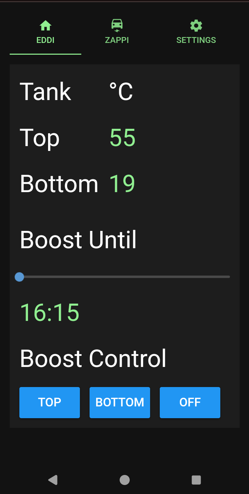

# Hot water tank display
The myenergi display software allows the user to monitor and control the hot water tank connected to the eddi device. To display the hot water tank temperatures the PT1000 temperature sensors must be connected to the eddi. The [eddi relay & sensor board](https://www.myenergi.com/product/eddi-relay-sensor-board/) must be fitted to the eddi in order to connect the PT1000 sensors.

With sensors connected to monitor the top and bottom of the tank the eddi tab on the myenergi display software shows the following.

The display shows the temperatures reported by the two PT1000 temperature sensors on the eddi unit.

The display also allows the user to set the eddi unit to boost the top or bottom emersion tank heaters (assuming both are connected to the eddi unit). If you only have one emersion heater is connected then only one of the buttons will turn on the tank heater.

When a button is selected the command is sent to the myenergi system to turn on the tank heater. It may take a min or two for the myenergi system to turn on the tank heater. When the tank heater is on the selected button will turn green. The threshold for the button going green is 2.5 kW.

The following shows the bottom boost turned on.

The time period for the boost can be set on the slider at the bottom of the screen before selecting either the top or bottom buttons.

### Note

- None of the features of the myenergi display override the myenergi app. Therefore you can always switch to the my energi app and turn on/off the boost if required.

- If the emersion heater reaches temperature and it's internal thermostat disconnects the heater element then the eddi turns off the heating boost. This is how the eddi boost function works and is the same as when the myenergi app is used to boost the hot water temperature.
