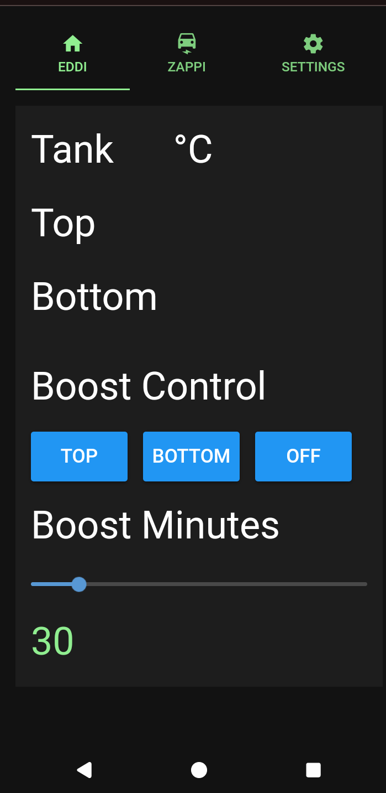

# Starting the myenergi display server

The myenergi display program runs as a server program (app) on a computer on your local network (house LAN).
This server application allows users connected to your LAN by WiFi or physical RJ45 cables to access
the myenergi display server. You should never configure your router to expose this server to the
internet directly. It is designed to be used only from your house network.

Once installed on the computer connected to your LAN (I used a Raspberry Pi zero 2 W) it maybe started from
a command line interface (terminal on Linux or Cmd/Powershell on Windows machines) by entering command below.

```
root@machinename:/root/# myenergi_display
myenergi_display
INFO:  Saved config to /root/.config/myenergi_display.cfg
INFO:  Loaded config from /root/.config/myenergi_display.cfg
INFO:  Loaded config from /root/.config/myenergi_display.cfg
NiceGUI ready to go on http://localhost:8080, and http://192.168.0.95:8080
```

The server is now running and waiting for web browsers to connect to it. You may see more than two links in the above message if your computer has more than one network interface. You can connect to the server from your mobile phone by entering the above URL that includes the IP address of the computer that the myenergi_dislay server is running on. In the above case this would be

```
http://192.168.0.95:8080
```

Your mobile device should then display the following



As the configuration has not yet been entered the temperatures of the top and bottom of the water tank are not displayed.


# Auto starting the myenergi display server
The myenergy display app can be auto started during boot by entering the following command on Linux computers (E.G Raspberry Pi zero 2).

```
root@machinename:/root/# myenergi_display --enable_auto_start
INFO:  OS: Linux
INFO:  SERVICE FILE: /etc/systemd/system/myenergi_display.service
INFO:  Created /etc/systemd/system/myenergi_display.service
INFO:  Enabled myenergi_display.service on restart
INFO:  Started myenergi_display.service
```

You can check the myenergi_display program/app is running using the following command.

```
root@machinename:/root/# myenergi_display --check_auto_start
INFO:  OS: Linux
INFO:  ● myenergi_display.service
INFO:       Loaded: loaded (/etc/systemd/system/myenergi_display.service; enabled; preset: enabled)
INFO:       Active: active (running) since Mon 2024-12-02 05:37:13 GMT; 1min 16s ago
INFO:     Main PID: 2811598 (myenergi_displa)
INFO:        Tasks: 8 (limit: 38285)
INFO:       Memory: 59.4M (peak: 60.1M)
INFO:          CPU: 5.296s
INFO:       CGroup: /system.slice/myenergi_display.service
INFO:               └─2811598 /root/.local/share/pipx/venvs/myenergi-display/bin/python /root/.local/bin/myenergi_display
INFO:
INFO:  Dec 02 05:37:13 L7490 systemd[1]: Started myenergi_display.service.
INFO:
INFO:
```

If you wish to stop the myenergi_display app starting when the computer starts up the following command can be used.

```
root@machinename:/root/# myenergi_display --disable_auto_start
INFO:  OS: Linux
INFO:  SERVICE FILE: /etc/systemd/system/myenergi_display.service
INFO:  Disabled myenergi_display.service on restart
INFO:  Stopped myenergi_display.service
```

# Command line help
The myenergi_server command line help is displayed below.

```
root@machinename:/root/# myenergi_display -h
usage: myenergi_display [-h] [-p PORT] [--reload] [--show] [-d] [--nicegui_debug] [-s] [--enable_auto_start] [--disable_auto_start] [--check_auto_start]

A program that provides a display interface for myenergi products.

options:
  -h, --help            show this help message and exit
  -p PORT, --port PORT  The TCP server port to which the GUI server is bound to (default=8080).
  --reload              Reload/Restart GUI when python file is updated. Useful for in dev env.
  --show                Show the GUI (open browser window) on startup.
  -d, --debug           Enable debugging of the myenergi_display program.
  --nicegui_debug       Enable debugging of the nicegui python module.
  -s, --syslog          Enable syslog.
  --enable_auto_start   Auto start when this computer starts.
  --disable_auto_start  Disable auto starting when this computer starts.
  --check_auto_start    Check the status of an auto started icons_gw instance.
```


