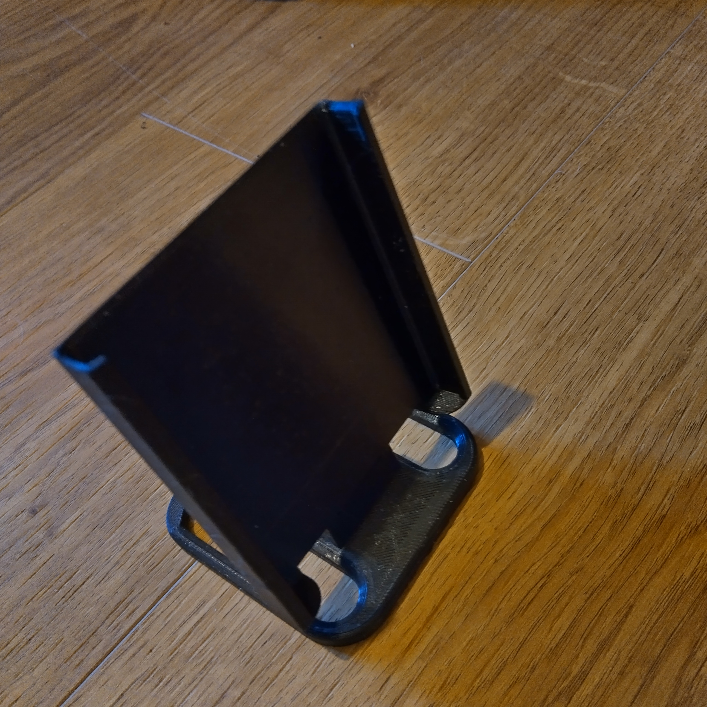
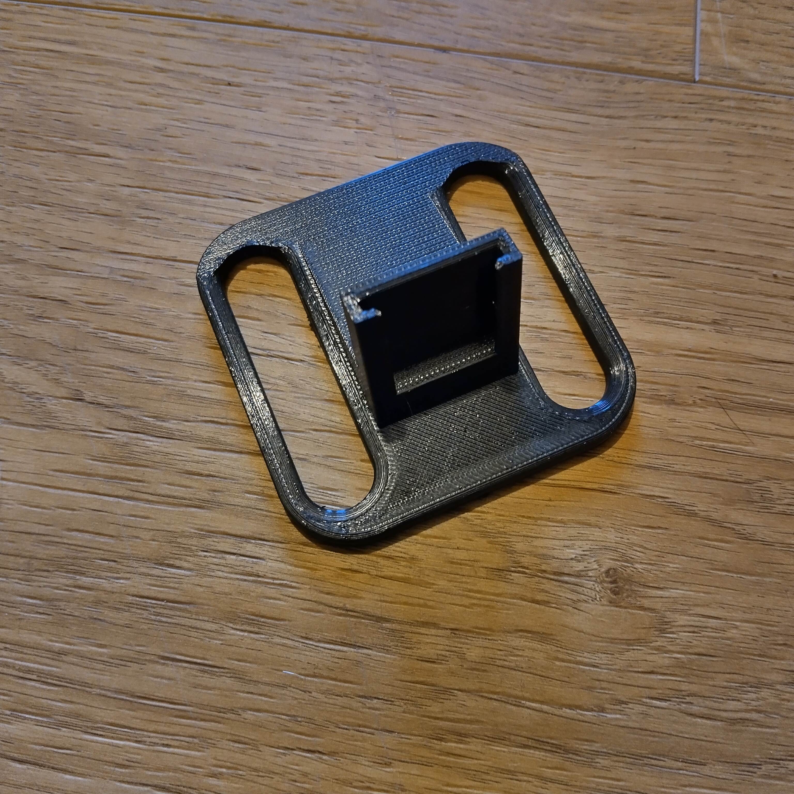
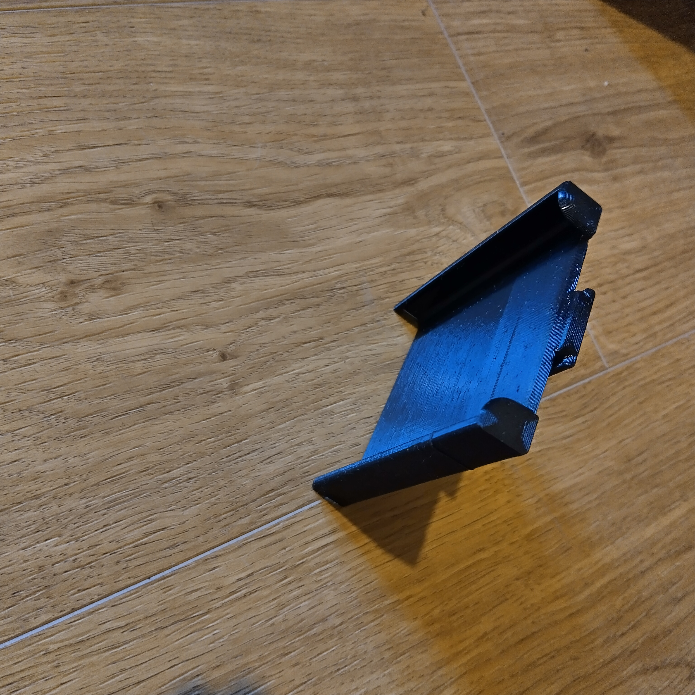
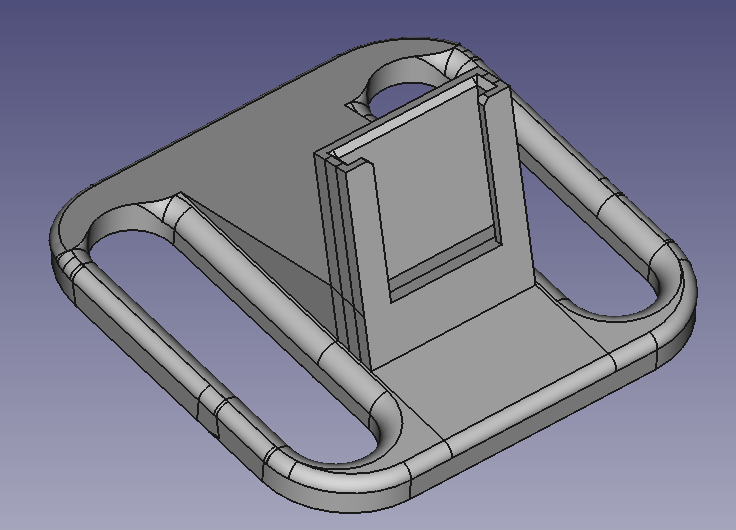
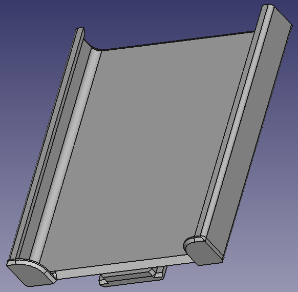

# Mobile phone stand
I designed a the stand shown below to hold the mobile phone on a shelf with space underneath to have a right angled USB connector powering the phone. The base and top files were created using [freecad](https://www.freecad.org/).

 

 

This was designed for a Samsung M30S phone. It should be simple enough to change the width and depth to accommodate other types of phone if required.

The stand was 3D printed using PETG filament.